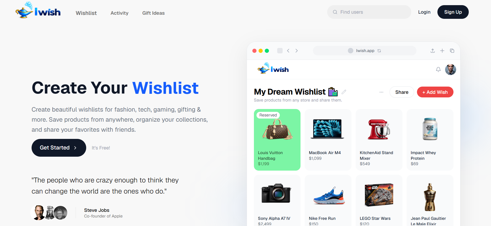

# 🎁 IWish

A modern, full-stack wishlist platform where users can create, organize, and share wishlists with friends and family. Save products from any online store, manage multiple wishlists, discover popular brands, and enjoy a clean, responsive user experience.


---

## 📸 Preview



🔗 **Live Website:** https://iwish-orpin.vercel.app/

---

# ✨ Features

### 👤 Authentication
- Secure Sign Up & Login
- Session management with Supabase Authentication
- Protected routes
- Persistent user sessions

### 🎁 Wishlist Management
- Create unlimited wishlists
- Edit and delete wishlists
- Beautiful responsive wishlist cards
- Unique wishlist URLs
- Share wishlists with anyone

### 🛍️ Product Management
- Add products from any online store
- Product preview generation
- Store logo detection
- Product image support
- Price tracking
- Product gallery
- External purchase links

### 🌎 Brand Discovery
- Discover popular brands
- Browse products by category
- Modern brand showcase
- Responsive brand grid

### 👤 User Profiles
- Custom usernames
- Profile avatars
- Personal dashboard
- Wishlist statistics

### 🎨 Modern UI/UX
- Fully responsive design
- Premium landing page
- Smooth animations
- Modern card layouts
- Mobile-first experience
- Optimized user experience

---

# 🛠️ Tech Stack

### Frontend
- Next.js 15 (App Router)
- React
- TypeScript
- Tailwind CSS
- shadcn/ui
- Lucide React

### Backend
- Supabase
- PostgreSQL Database
- Supabase Authentication
- Supabase Storage

### Deployment
- Vercel
- GitHub

---

# 🔒 Security

The application includes several security-focused implementations:

- Secure Supabase Authentication
- Route protection for authenticated users
- User-based database access
- Protected API routes
- Secure environment variables
- Server-side validation
- Client-side input validation
- Safe file upload handling
- External URL validation
- Unauthorized access prevention

---

# 📂 Project Structure

```text
app/
components/
hooks/
lib/
public/
styles/
```

---

# ⚡ Performance

- Server Components
- Optimized Image Loading
- Lazy Loading
- Responsive Images
- Optimized Assets
- Fast Page Navigation
- Production Deployment on Vercel

---


---


---


# 📈 Future Improvements

- Gift reservation system
- Email notifications
- AI product recommendations
- Dark mode
- Advanced search & filtering
- Product price history
- Public wishlist discovery

---

# 👨‍💻 Author

**Bedirhan Elçik**

GitHub: https://github.com/Bedirhanelcik

LinkedIn: https://linkedin.com/in/bedirhanelcik

---
⭐ If you like this project, consider giving it a star!
